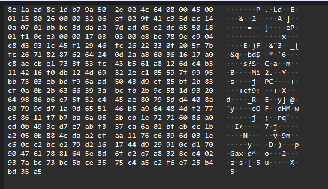
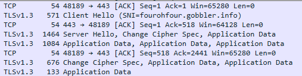
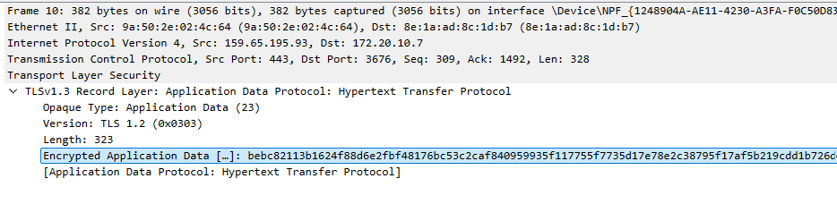
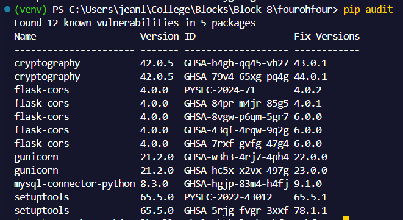

# Penetration Testing Report

## Executive Summary
This report details the security assessment conducted on our file sharing application, covering both client and server-side components. 
TODO BEEF UP
## Key Findings
Below is a list of all major vunerabilities discovered during penetration testing. 

TODO file upload size etc 
**Name (Standardised)**
- **Location:**
- **Technique used to find:**
- **Proof of Concept:**
- **Likelihood of exploitation:**
- **Potential Impact:**
- **Risk Assessment :**
- **Reccomendations:**

**Vunerable Libraries**
- **Cryptographic operations used for TODO:**
- **TDependency audit**
- **Proof of Concept:**
- **Likelihood of exploitation:**
- **Potential Impact:** As cryptographic libraries contain known vunerabilities, an attacker could potentially read and alter sensitive information
- **Risk Assessment :** CVSS Score of (High) 
- **Update dependency packages, periodically audit going forward**


## Engagement Summary
Testing was performed from 31/05/25 to 01/06/25, once all major components of the project were completed, and to give the team time to remediate the vunerabilities discovered. 
The testing was performed with the assumption that neither client nor server can be fully trusted, implementing a zero-trust security model. Our testing methodology combined automated scanning tools with manual penetration testing to ensure comprehensive coverage of potential vulnerabilities, and applied OWASP and CVSS 3.1 standards to identify and catagorise vunerabilities. TODO TIDY UP

**Scope of Testing**
- Server-side API endpoints
- Client-side web application
- Authentication mechanisms
- File handling and permissions
- Database interactions
- Cryptographic implementations

## Testing Methodology
### Testing Tools
1. **OWASP ZAP (Zed Attack Proxy)**
   - Automated vulnerability scanning
   - API endpoint testing
   - Authentication testing
   - Session management analysis
   - Configuration: Full scan with maximum alert levels

2. **Burp Suite Professional**
   - API security testing
   - Authentication bypass attempts
   - Session handling analysis
   - Configuration: Intercepting proxy with active scanning

3. **Postman**
   - API endpoint testing
   - Authentication flow testing
   - Request/response analysis
   - Custom test collections for automated testing

4. **Wireshark**
   - Network traffic analysis
   - TLS/SSL implementation verification
   - Data transmission security
   - Configuration: Full packet capture during testing

### Manual Inspection
1. Code review of security-critical components
2. Cryptographic implementation analysis
3. Configuration security audit
4. Dependency vulnerability assessment

## Full Penetration Testing Results

### 1. Improper Input Validation

#### Test Case: File Size Validation Bypass
**Description:** Attempted to bypass file size restrictions through various methods including malformed requests and size manipulation.
**Testing Method**:
Used Postman to send files exceeding the 100MB limit
Attempted to manipulate Content-Length headers to bypass size restrictions
Tested with malformed multipart/form-data requests
Monitored server response and database behavior

**Finding**s:
- Files exceeding size limit cause server crashes instead of graceful rejection
- Size validation occurs only at database level, not application level
- Server accepts malformed requests without proper validation
- No proper error handling for oversized files
- Client-side size validation can be bypassed by manipulating request headers

**Protection Mechanisms:**
- Implement application-level file size validation before database interaction
- Configure Flask's MAX_CONTENT_LENGTH to match database constraints
- Add proper error handling for oversized files
- Implement request validation for Content-Length headers
- Add server-side validation independent of client-side checks
- Implement proper error responses instead of server crashes
- Add logging for failed upload attempts

### 2. Broken Authentication

#### Test Case: JWT Token Security
**Description**: Analyzed JWT implementation and token handling.

**Testing Method**:
- Used Burp Suite to analyze token structure
- Tested token invalidation and refresh mechanisms:
    - Attempted to perform file uploads with a logged out user's token
   - Attempted token manipulation to change the timestamp of a logged out user's token, and tries to fetch files from another user
   - Attempted to resign manipulated tokens to pass integrity checks


**Findings**:
- When accessing files with a logged out user's token the request is rejected with message `'Token has been invalidated', 401`
- After changing the Issued At timestamp of an invalidated token, we recieve an error `Missing or malformed token`, as integrity checks fail
- TODO when we resign

**Protection Mechanisms**:
- Ensure that JWT_SECRET_KEY is properly configured
- Token signing is in place, to protect against token manipulation
- JWT_SECRET_KEY properly configured
- Token expiration and refresh mechanisms are properly configured

### 3. Broken Access Control

#### Test Case: File Permission Bypass
**Description:** Conducted comprehensive testing of the file access control system to identify potential permission bypass vulnerabilities.

**Testing Method:**
- Utilized Postman to simulate various access control scenarios
- Established two distinct user accounts with separate authentication tokens
- Created a test file under User 1's ownership
- Attempted unauthorized access using User 2's credentials
- Conducted horizontal privilege escalation testing by manipulating file access requests

**Findings:**
- System correctly enforced access controls with appropriate 403 Forbidden responses
- Robust permission verification system prevented unauthorized access attempts
- Owner-based access control mechanisms functioned as intended
- No Insecure Direct Object Reference (IDOR) vulnerabilities were identified
- Access control checks were consistently applied across all file operations

**Protection Mechanisms:**
- Multi-layered permission verification system in file access routes
- Strict owner validation in permission management system
- Comprehensive error handling for unauthorized access attempts
- Proper separation of user contexts and access rights

#### Test Case: Path Traversal
**Description:** Conducted comprehensive testing of path traversal vulnerabilities in file operations, focusing on attempts to access files from outside the designated uploads directory.

**Testing Method:**
- Used Postman to send crafted path traversal payloads to file endpoints
- Tested with various path traversal techniques targeting the uploads directory
- Tested with URL encoding variations
```
  GET /api/files/../../uploads/other_user_file.txt
  GET /api/files/..%2f..%2fuploads%2fother_user_file.txt
  GET /api/files/..\..\uploads\other_user_file.txt
  GET /api/files/....//....//uploads//other_user_file.txt
  GET /api/files/%2e%2e%2f%2e%2e%2fuploads%2fother_user_file.txt
```

**Findings:**
- All path traversal attempts were properly blocked
- System correctly rejected attempts to access files outside the user's designated area in the uploads directory

**Protection Mechanisms:**
- Secure filename sanitisation using werkzeug.utils.secure_filename
- Proper file path construction using os.path.join is in place
- User-specific file path prefixes to prevent cross-user access

### 4. Cryptographic Issues

#### Test Case: File Encryption Implementation
TODO Client side encryption??

### 5. Injection

#### Test Case: SQL Injection in Login
**Description**: Conducted comprehensive testing of SQL injection vulnerabilities in authentication endpoints, focusing on login and password management functionality.

**Testing Method**:
- Manual testing with common SQL injection payloads such as
   ```
   #Tested login endpoint with payloads
    {
    "username": "admin' OR '1'='1",
    "password": "anything"
    }
    {
    "username": "admin'--",
    "password": "anything"
    }
   #Attempted to bypass password verification
   {
    "username": "valid_user",
    "password": "' OR '1'='1"
   }
   ```
- Tested database interaction points such as login, change password

**Findings**:
- No SQL injection vulnerabilities found
- Proper use of parameterized queries
- Input sanitization in place

**Protection Mechanisms**:
- SQLAlchemy ORM usage
- Parameterized queries
- Input validation

#### Test Case: SQL Injection in File Queries
**Description**: Conducted testing of common SQL injections when retrieving files, in attempt to retrieve another users file

**Testing Method**:
- Manual testing with common SQL injections in the url
   ```
   GET /api/files/1' OR '1'='1
   GET /api/files/1'--
   GET /api/files/1' OR 1=1--
   GET /api/files/1' UNION SELECT * FROM files--
   GET /api/files/384c2f09-c878-42ca-a6c9-d4a826b65b5c' OR '1'='1
   GET /api/files/384c2f09-c878-42ca-a6c9-d4a826b65b5c'--
   GET /api/files/384c2f09-c878-42ca-a6c9-d4a826b65b5c' OR 1=1--
   ```

**Findings**:
- No SQL injection vulnerabilities found
- Input sanitisation is in place - file UUID is validated before use using the Python UUID libary
- Proper use of parameterized queries

**Protection Mechanisms**:
- SQLAlchemy ORM usage
- Parameterized queries
-Secure error handling
- Input validation at multiple levels

### 6. Security Misconfiguration

#### Test Case: Server Configuration
**Description**: Analyzed server and application configuration.

**Testing Method**:
- Used OWASP ZAP to scan for misconfigurations
- Manual review of security headers
- Analysis of CORS implementation

**Findings**:
- Proper CORS configuration
- Secure headers implemented
- Debug mode disabled in production

**Protection Mechanisms**:
- Environment-based configuration
- Secure default settings
- Proper error handling

### 7. Sensitive Data Exposure

#### Test Case: SSL over HTTPS communication
**Description**: Analyzed packets to ensure that sensitive information such as passwords could not be read if intercepted

**Testing Method**:
- Used Wireshark to monitor network traffic and verify that transmitted requests were encrypted
- Sent requests via Postman, testing sign up and login
- Analysed the transmission protocol
- Captured packets and analysed that they are unreadable and sent over a secure protocol
- Attempted to send the same request to a HTTP URL

**Findings**:
- Login and signup requests could be easily intercepted, but their contents were unreadable
- Application data packets were transmitted via TLS 1.3
- The client/server handshake packets were visible, confirming that a key exchange takes place *(see fig TODO)
- The request to the HTTP URL was rejected

           


**Protection Mechanisms in Place**:
- SSL/TLS communication over HTTPS is enforced by the server.
- Requests that do not use HTTPS are rejected, ensuring that a poorly configured client cannot communicate. 


#### Test Case: File Content Protection
**Description**: Analyzed file content handling and storage.

**Testing Method**:
- Used Wireshark to monitor network traffic and verify that transmitted file contents were encrypted
- Captured network packets during file uploads and downloads
- Analyzed transmission protocol (HTTPS/TLS)- Analyzed storage mechanisms
- Tested file access controls

**Findings**:
- Files are transmitted over TLS 1.3 

**Protection Mechanisms**:
- File content encryption during transit

    


### 8. Vulnerable Components

#### Test Case: Dependency Analysis
**Description**: Analyzed application dependencies for known vulnerabilities.

**Testing Method**:
- Used `pip-audit` to scan for vunerabilities in installed dependencies

**Findings**:
- 12 vulnerabilities were discovered across 5 packages (see figureTODO below)
- Version pinning in a requirements.txt file was in place, however the versions were not always recent

    


**Protection Mechanisms**:
- The current packages should be updated to secure versions where possible, or an alternative used instead. 
- Regular dependency updates
- Regular dependency audits as new vunerabilities may be found over tiem
- Version pinning in requirements (already implemented)

TODO maybe get rid of this
## Recommendations
1. Implement rate limiting for API endpoints
2. Add additional logging for security events
3. Regular security audits of dependencies
4. Implement automated security testing in CI/CD

## Conclusion
The application demonstrates strong security measures across all tested areas. No critical vulnerabilities were found, and existing protections effectively mitigate common attack vectors. Regular security testing and updates are recommended to maintain security posture.


## Appendix
### Ratings and Risk Score
TODO explain risk scores, maybe put a table from cvss

### Vunerability Details
TODO list of tested for vunerabilities

### Test Environment Details TODO
- Local development environment
- Production-like staging environment
- Isolated testing network

### Tools Used
1. OWASP ZAP
   - Version: 2.12.0
   - Configuration: Full scan with maximum alert levels

2. Burp Suite Professional
   - Version: 2023.1.1
   - Configuration: Intercepting proxy with active scanning

3. Postman
   - Version: 10.14.0
   - Custom test collections
   - Automated testing scripts

4. Wireshark
   - Version: 4.0.3
   - Full packet capture
   - TLS/SSL analysis


